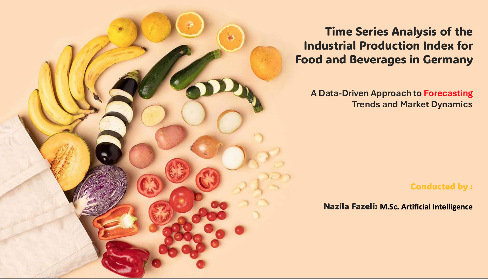
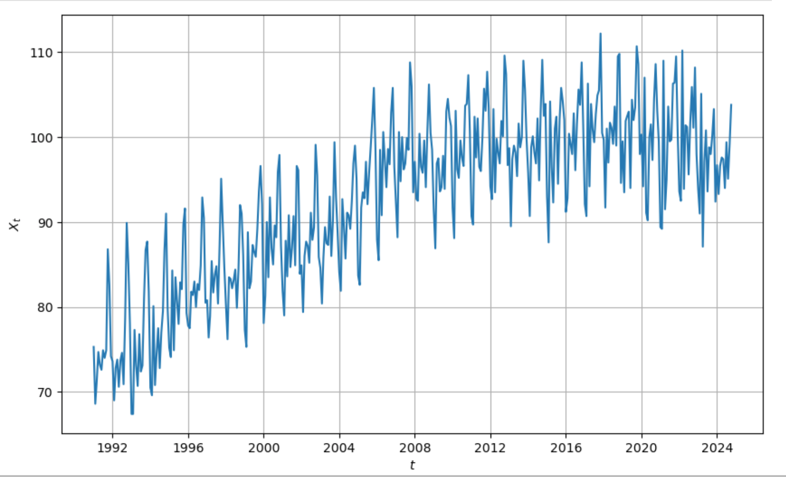
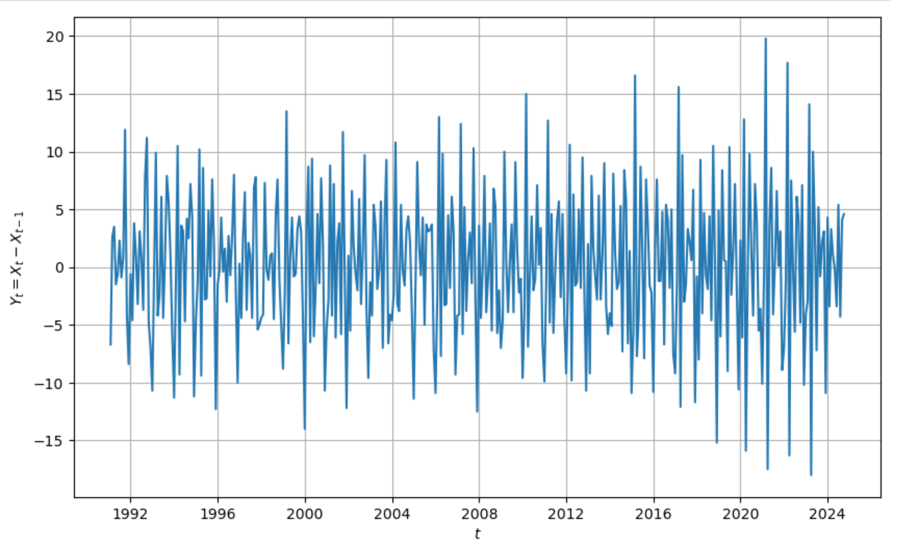
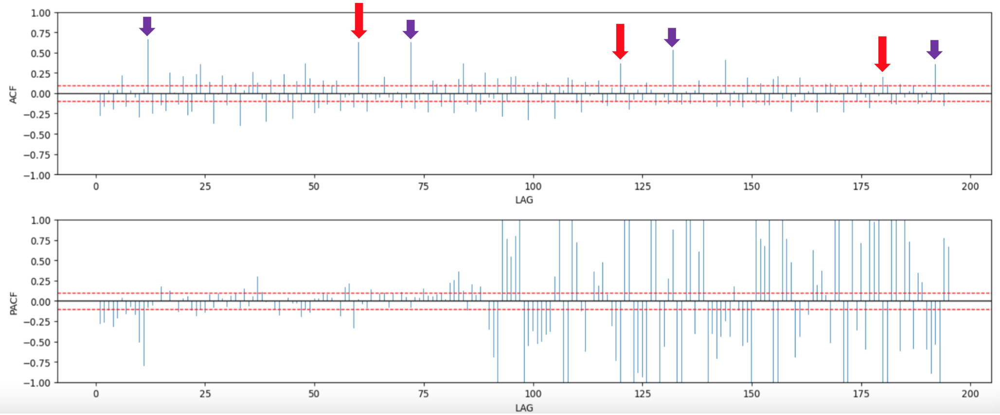
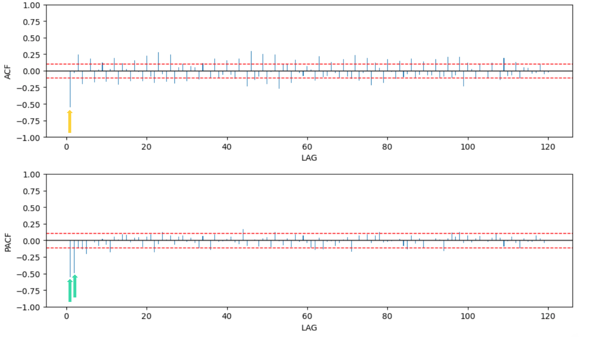
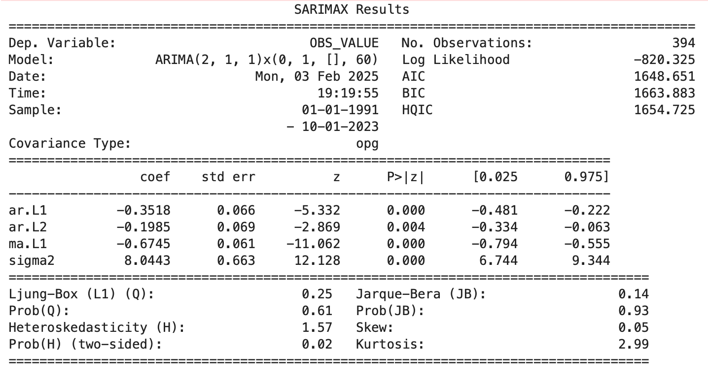
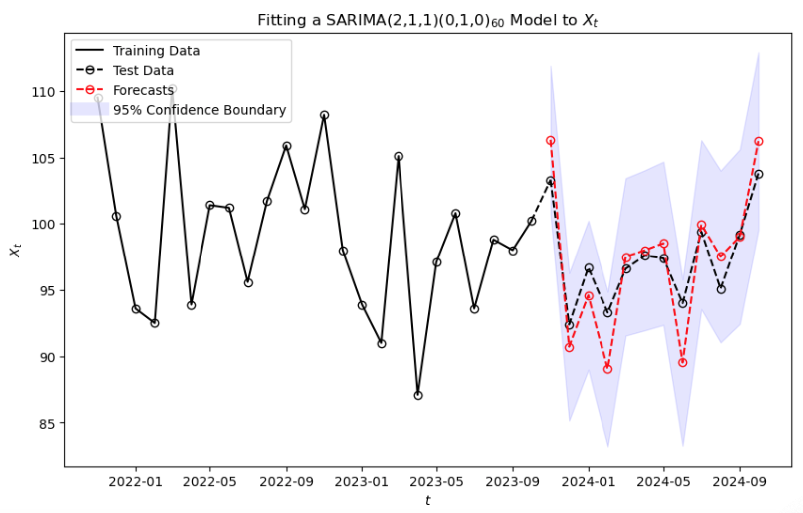

# Food & Beverage Production Forecast – Germany

This repository contains a time series forecasting project focused on the **Industrial Production Index (IPI)** for the **Food and Beverage manufacturing sector** in Germany. Using official Eurostat data from **1991 to 2024**, the project aims to build a reliable predictive model using **SARIMA**, assess its performance, and forecast the next 12 months.

All analysis and modeling were performed using **Python**.

---

## 🎯 Project Objectives

- Forecast future production trends in Germany’s food & beverage industry.
- Explore seasonality and long-term patterns using time series techniques.
- Evaluate multiple SARIMA models and select the most accurate.
- Assess whether external variables like oil prices or GDP improve model performance.

---

## 📂 Dataset Information

- **Source**: Eurostat – Short-Term Business Statistics
- **Sector**: Manufacture of Food Products and Beverages
- **Country**: Germany
- **Period**: Monthly data from **January 1991 to October 2024**
- **Adjustment**: Unadjusted (neither seasonally nor calendar adjusted)
- **Index Base Year**: 2021 = 100
- **Data Format**: CSV (406 records, no missing values)

---

## 🧭 Project Workflow (Step-by-Step)

### 1. Data Preprocessing
- Loaded the raw dataset from Eurostat.
- Selected two columns: `TIME_PERIOD` and `OBS_VALUE`.
- Converted numeric formatting (comma to dot) and parsed dates.
- Transformed the dataset into a monthly time series format.

### 2. Initial Data Analysis & Stationarity Check
- Plotted the original time series: showed a clear upward trend.
- Performed **KPSS Test** → data was **non-stationary**.



### 3. Data Transformation
- Applied **first differencing** to remove the trend.
- KPSS confirmed stationarity after this transformation.



### 4. Train-Test Split
- The last 12 months of the dataset were held out as a **test set**.
- The remaining 394 months were used for training the model.

### 5. Seasonality Detection
- Plotted **ACF** and **PACF** → identified strong seasonal correlation every 60 lags (≈ 5 years).
- Indicated the presence of seasonality, guiding SARIMA parameter selection.




### 6. Model Selection
- Evaluated 10 SARIMA models with different (p,d,q)(P,D,Q,m) values.
- Chose **SARIMA(2,1,1)(0,1,0,60)** as the final model based on:
  - Lowest AIC and BIC values
  - Statistically significant p-values for all coefficients



### 7. Forecasting
- Forecasted the next 12 months of production.
- Plotted predictions with 95% confidence intervals.



### 8. Model Evaluation
- **MAPE (Mean Absolute Percentage Error)** = **2.9%**
- Indicates high accuracy in predicting unseen data.

### 9. External Variable Testing
- Tested exogenous variables: oil price, cereal index, GDP
- No improvement in model performance → SARIMA retained without exogenous variables

---

## 📈 Model Evaluation

| Metric | Value |
|--------|-------|
| Final Model | SARIMA (2,1,1)(0,1,0)[60] |
| MAPE | 2.9% |
| Accuracy | High (based on test set) |
| External Factors | No significant impact |

---

## 📁 Repository Structure

```
Food-Bev-Forecast-Germany/
├── data/
│   ├── estat_sts_inpr_m_filtered_en.csv
│   └── food_bev_forecasting_data.csv
├── analysis/
│   └── food_bev_forecasting_notebook.ipynb
├── presentation/
│   └── NazilaFazeli_food_bav_germany.pptx
├── images/
│   └── cover.png
├── README.md
└── requirements.txt
```

---

## ✅ Summary & Future Work

This project showcases how classical time series models like SARIMA can accurately forecast industrial production. With a **2.9% MAPE**, the model provides strong predictive power without the need for external regressors.

### Future Opportunities:
- Explore **prophet** or **LSTM** models for nonlinear trends.
- Investigate monthly or seasonal **economic indicators** as exogenous inputs.
- Automate retraining pipeline for real-time forecasting.

---

## 🧰 Dependencies

The following Python libraries were used in this project:

- **pandas** – for handling and manipulating time series data  
- **numpy** – for numerical operations  
- **matplotlib / seaborn** – for visualizations  
- **scipy** – for statistical testing and metrics  
- **statsmodels** – for SARIMA modeling and diagnostic tests  
- **arch** – for performing the KPSS stationarity test  
- **astsadata** – for loading sample time series datasets (if used)
